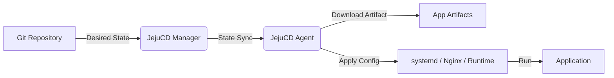

[English](README.md) | [한국어](README.ko.md)

# JejuCD

**대한민국 중소기업의 인프라 현실에 맞춘 GitOps CD**

JejuCD는 Kubernetes까지는 필요 없지만, Argo CD처럼 Git을 기준으로 배포 상태를 관리하고 싶은 조직을 위한 경량 GitOps CD 도구입니다.

Vercel, Supabase 같은 PaaS는 초기 도입과 빠른 제품 검증에 강력합니다. 하지만 서비스가 성장하거나 비용 통제, 폐쇄망, 온프레미스, 보안 요구사항이 생기면 자체 인프라에서 안정적으로 배포할 수 있는 선택지가 필요해집니다.

반대로 Kubernetes는 강력하지만, 중소기업이나 현장형 조직이 운영하기에는 복잡도와 인력 부담이 큽니다.

JejuCD는 이 사이의 현실적인 영역을 목표로 합니다. 기존 VM, EC2, 물리 서버, 엣지 장비에 컨테이너 오케스트레이션 없이 애플리케이션 아티팩트를 직접 배포하고, Git에 선언된 상태를 기준으로 서버 상태를 안전하게 동기화합니다.

---

## 어떤 팀을 위한 도구인가요?

JejuCD는 다음과 같은 상황에 잘 맞습니다.

- 수동 배포는 위험하지만 Kubernetes는 아직 부담스러운 팀
- PaaS나 대형 클라우드 의존도를 줄이고 기존 서버 자원을 활용하고 싶은 조직
- 폐쇄망, 온프레미스, 공장, 병원, 금융권 하청, 엣지 서버처럼 외부 클라우드 사용이 어려운 환경
- Kubernetes 전문 인력 없이도 GitOps 방식의 배포 이력을 남기고 싶은 팀
- 서버별 역할과 배포 대상을 명확하게 관리해야 하는 운영 환경

JejuCD는 Kubernetes의 대체재라기보다, Kubernetes를 도입하기 전 단계 또는 Kubernetes가 과한 조직을 위한 실용적인 GitOps CD 도구입니다.

---

## 작동 방식

JejuCD는 Git에 선언된 원하는 상태(desired state)를 기준으로 각 서버를 동기화합니다.

1. Git 저장소의 TOML 파일에 서버와 애플리케이션 상태를 선언합니다.
2. Manager가 Git 변경 사항을 읽고 필요한 상태 차이를 계산합니다.
3. 각 서버의 Agent는 자신에게 해당하는 설정만 적용합니다.
4. Agent는 필요한 애플리케이션 아티팩트를 내려받고, systemd, Nginx, 런타임 설정을 안전하게 반영합니다.
5. 앱이 원하는 배포 조건과 서버가 선언한 역할/태그 조건이 함께 맞을 때만 배포됩니다.

---

## 핵심 철학

### 단순함

JejuCD는 무거운 컨테이너 런타임이나 복잡한 오케스트레이터를 전제로 하지 않습니다. Rust 기반의 경량 Agent가 각 서버에서 필요한 배포 작업과 실행 환경 설정을 적용합니다.

### 명확한 배포 대상

배포 대상과 애플리케이션 상태는 Git에 명시적으로 선언됩니다. 앱이 원하는 environment, role, tag, node name 조건과 서버가 선언한 역할/태그 조건이 함께 맞아야 배포됩니다.

### 장애 격리

각 서버는 자신에게 해당하는 상태만 기준으로 동작합니다. 특정 서버의 설정 오류가 다른 서버로 번지는 일을 줄이고, 어느 서버에 어떤 애플리케이션이 배포되는지 명확하게 확인할 수 있습니다.

### 기존 인프라 활용

JejuCD는 기존 VM, EC2, 물리 서버, 엣지 장비를 그대로 활용하는 것을 목표로 합니다. 이미 운영 중인 Linux 서버와 systemd 기반 운영 방식에 맞춰 동작합니다.

---

## 현재 상태

JejuCD는 현재 초기 개발 단계의 제품입니다. 향후 개발 과정과 사용자 피드백에 따라 기능과 구조가 변경될 수 있습니다.

또한 기존에는 "바이너리 배포" 중심으로 설명했지만, 제품 방향성은 특정 실행 파일 형식에 한정되지 않는 "애플리케이션 아티팩트 배포"입니다. 현재는 바이너리 배포가 주요 사용 사례이며, 앞으로는 빌드 결과물을 더 넓게 다룰 수 있도록 설계하고 있습니다.

---

## 라이선스

이 프로젝트는 [Apache License 2.0](LICENSE)에 따라 배포됩니다.
