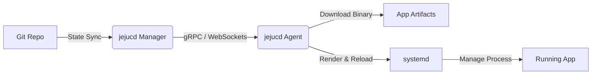

[English](README.md) | [한국어](README.ko.md)

# jejucd: 모두를 위한 순수 바이너리 GitOps CD


현대적인 지속적 배포(CD)를 위해 굳이 쿠버네티스(Kubernetes) 전문가가 될 필요는 없습니다. jejucd는 GitOps의 강력한 선언적 모델, 상태 동기화, 그리고 안전성을 **순수 바이너리**를 통해 베어메탈 서버, VPS, 그리고 엣지(Edge) 디바이스에 직접 제공합니다.

컨테이너도, 오케스트레이터의 오버헤드도 없습니다. 오직 여러분의 코드와 Git, 그리고 `systemd`만 있으면 됩니다.

---

## 왜 jejucd인가요?


중소기업(SMB), 온프레미스 환경, IoT 엣지 네트워크에서 무거운 쿠버네티스 클러스터를 구축하거나 Vercel, Supabase 같은 값비싼 PaaS에 의존하는 것은 종종 과한 스펙(Overkill)이자 막대한 비용 부담을 초래합니다.

jejucd는 ArgoCD의 우아한 운영 방식을 원하면서도, 정적 컴파일된 바이너리(Rust, Go)나 독립형 런타임을 Linux 서버에 직접 실행하는 압도적인 성능과 단순함을 필요로 하는 팀을 위해 설계되었습니다.

---

## 핵심 기능


* **쿠버네티스 오버헤드 제로:** 5달러짜리 저렴한 VPS부터 거대한 온프레미스 데이터센터까지 완벽하게 동작합니다.
* **네이티브 systemd 위임:** 바퀴를 다시 발명하지 않습니다. jejucd Agent는 프로세스의 라이프사이클, 크래시 복구, 로그 관리를 Linux 표준인 `systemd`에 위임하여 절대적인 안정성을 보장합니다.
* **이중 잠금 타겟팅 (Double-Lock Targeting):** 대규모 오배포 사고를 방지합니다. 배포 대상은 엄격한 Enum(역할, 환경)과 유연한 Tag의 교집합($Target = Enum \cap Tag$)으로 안전하게 계산됩니다.
* **장애 반경 제로 (Zero Blast Radius):** 노드 설정 파일과 물리적 하드웨어를 1:1로 엄격하게 매핑합니다. 단 하나의 파일에 발생한 설정 오류가 절대 다른 노드로 전파되지 않습니다.
* **압도적인 속도 & 초경량:** Manager와 Agent 모두 Rust(Axum)로 작성되었습니다. Agent는 극도로 적은 메모리만을 사용하며, 가비지 컬렉션(GC)으로 인한 멈춤 현상이 전혀 없습니다.

---

## 아키텍처 개요


jejucd 생태계는 크게 세 가지 핵심 구성 요소로 이루어집니다:

1. **Git State Repository (상태 저장소):** 모든 노드와 애플리케이션의 정확한 목표 상태를 담고 있는 단일 진실 공급원(SSOT)입니다.
2. **Manager App (매니저 앱):** 컨트롤 플레인 역할을 합니다. Git 저장소의 변경 사항을 감지하여 Diff를 계산하고, Agent들과 안전하게 통신합니다.
3. **Agent App (에이전트 앱):** 배포 대상 서버에 설치되는 가벼운 데몬입니다. 상태 변경을 수신하고, 필요한 바이너리를 다운로드하며, `.service` 파일을 업데이트한 후 `systemctl` 명령을 실행합니다.



---

## "장애 반경 제로" 철학


그룹 단위의 추상화를 통해 수천 대의 노드를 관리하려다 보면, 결국 통제 불가능한 '예외 케이스(Snowflake)'들이 발생하기 마련입니다. jejucd는 극단적인 단순함을 추구합니다: **하나의 노드, 하나의 파일(One Node, One File).**

이로 인해 관리해야 할 파일의 수가 많아지더라도(예: 500개 노드 = 500개 파일), 당사의 CLI 도구가 모든 복잡한 작업을 대신 처리합니다:

```bash
# CLI 스캐폴딩을 통해 500개의 노드 설정을 즉시 생성합니다
jejucd generate nodes --base dc-seoul.toml --count 500 --prefix worker
```

이를 통해 단일 파일의 오류는 정확히 해당 장비 하나에만 국한되며, 엔터프라이즈 및 엣지 배포 환경에서 궁극적인 안전성을 보장합니다.

---

## 빠른 시작


*설치 스크립트 및 상세 문서는 곧 제공될 예정입니다.*

**예상 워크플로우:**
1. `jejucd/state` 저장소를 Fork 합니다.
2. TOML 파일을 통해 원하는 바이너리 버전과 대상 노드를 정의합니다.
3. 배포 대상 서버에 jejucd Agent를 설치합니다:
   ```bash
   curl -sL https://jejucd.com/install.sh | bash
   ```
4. Git 저장소에 커밋을 푸시(Push)합니다. Agent가 몇 초 이내에 바이너리를 다운로드하고, systemd를 구성하여 선언된 상태와 서버를 동기화합니다.

---

## 기여하기 (Contributing)


JejuCD는 바이너리 배포의 미래를 만들어가고 있으며, 적극적으로 기여자를 찾고 있습니다! Rust 개발자, 데브옵스 엔지니어, 혹은 가벼운 인프라 도구에 열정을 가진 분이라면 누구든 PR을 환영합니다.

jejucd는 향후 LF Edge와 같은 글로벌 오픈소스 재단과 통합하여, 컨테이너 기반이 아닌 CD 환경의 새로운 표준을 세우겠다는 원대한 목표로 개발되고 있습니다.

---

## 라이선스

이 프로젝트는 [Apache License 2.0](LICENSE)에 따라 배포됩니다.