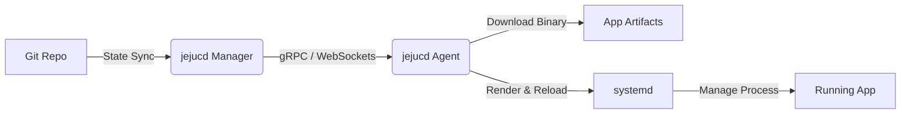

# jejucd: Pure-Binary GitOps CD for the Rest of Us


Modern continuous delivery shouldn't require a PhD in Kubernetes. jejucd brings the declarative power, drift reconciliation, and safety of GitOps directly to bare-metal servers, VPS, and Edge devices using pure binaries.

No containers. No orchestrator overhead. Just your code, Git, and systemd.

---

## Why jejucd?


For SMBs, on-premise environments, and IoT edge networks, deploying heavy Kubernetes clusters or relying on expensive PaaS (like Vercel or Supabase) is often overkill and cost-prohibitive.

jejucd is designed for teams that want the operational elegance of ArgoCD, but the raw performance and simplicity of running statically compiled binaries (Rust, Go) or standalone runtimes directly on Linux.

---

## Core Features


* **Zero K8s Overhead:** Runs flawlessly on anything from a $5 VPS to a massive on-premise data center.
* **Native systemd Delegation:** We don't reinvent the wheel. The jejucd Agent delegates process lifecycle, crash recovery, and log management to Linux's native systemd, ensuring bulletproof reliability.
* **Double-Lock Targeting:** Prevent catastrophic deployments. Targets are calculated using a strict intersection of Enums (Role, Env) and Tags ($Target = Enum \cap Tag$).
* **Zero Blast Radius:** We enforce a strict 1:1 mapping between node configuration files and physical hardware. A misconfiguration in a single file will never cascade to other nodes.
* **Blazing Fast & Ultra-Lightweight:** Both the Manager and Agent are written in Rust (Axum). The Agent has a microscopic memory footprint and zero garbage collection pauses.

---

## Architecture Overview


The jejucd ecosystem consists of three main components:

1. **Git State Repository:** The single source of truth. Contains the exact desired state of every single node and application.
2. **Manager App:** The control plane. It observes the Git repository, calculates diffs, and securely coordinates with the Agents.
3. **Agent App:** A lightweight daemon installed on your target servers. It listens for state changes, downloads the required binaries, updates the `.service` files, and issues `systemctl` commands.



---

## The "Zero Blast Radius" Philosophy


Managing configurations for thousands of nodes via group abstractions usually leads to unmanageable "snowflake" exceptions. jejucd embraces extreme simplicity: **One Node, One File**.

While this means a large number of files (e.g., 500 nodes = 500 files), our CLI tool handles the heavy lifting:

```bash
# Generate 500 node configurations instantly via CLI scaffolding
jejucd generate nodes --base dc-seoul.toml --count 500 --prefix worker
```

This guarantees that an error in one file is isolated to exactly one machine, ensuring ultimate safety for enterprise and edge deployments.

---

## Quick Start


*Coming soon: Installation scripts and comprehensive documentation.*

**Expected workflow:**
1. Fork the `jejucd/state` repository.
2. Define your desired binary versions and node targets via TOML.
3. Install the jejucd agent on your target machine:
   ```bash
   curl -sL https://jejucd.com/install.sh | bash
   ```
4. Push a commit to your Git repo. The Agent will pull the binary, configure systemd, and reconcile the state within seconds.

---

## Contributing


We are building the future of binary deployments and are actively seeking contributors. Whether you are a Rustacean, a DevOps engineer, or someone passionate about lightweight infrastructure, we welcome your PRs.

jejucd is built with the ambition to integrate with global open-source foundations (such as LF Edge) to set a new standard for non-containerized CD.

---

## License

This project is licensed under the [Apache License 2.0](LICENSE).