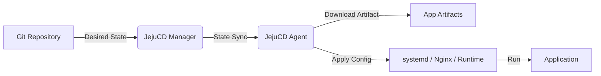

# JejuCD

**Practical GitOps CD for real-world infrastructure.**

[English](README.md) | [한국어](README.ko.md)

JejuCD is a lightweight GitOps CD tool for teams that do not need Kubernetes everywhere, but still want the convenience of managing deployment state from Git like Argo CD.

PaaS platforms such as Vercel and Supabase are excellent for early adoption and fast product validation. But as a service grows, teams may need more control over cost, network access, on-premise environments, regional infrastructure, and security requirements.

Kubernetes is powerful, but it can be too complex and labor-intensive for small and mid-sized companies, regional offices, factory sites, edge fleets, and regulated environments.

JejuCD targets the practical middle ground between PaaS convenience and Kubernetes complexity. It deploys application artifacts directly to existing VMs, EC2 instances, bare-metal servers, and edge devices without container orchestration, then safely reconciles server state from the desired state declared in Git.

---

## Who Is It For?

JejuCD is designed for teams that:

- need safer deployment than manual server operations, but are not ready for Kubernetes
- want to reduce dependency on PaaS or large cloud platforms
- need to use existing servers, on-premise infrastructure, closed networks, regional sites, or edge devices
- want GitOps-style deployment history without a dedicated Kubernetes operations team
- need clear control over which applications run on which servers

JejuCD is not positioned as a Kubernetes replacement. It is a practical GitOps CD tool for the stage before Kubernetes, or for organizations where Kubernetes is simply more than they need.

---

## How It Works

JejuCD reconciles each server from the desired state declared in Git.

1. Servers and applications are declared in TOML files in a Git repository.
2. The Manager reads Git changes and calculates the required state difference.
3. The Agent on each server applies only the configuration that belongs to that server.
4. The Agent downloads the required application artifacts and applies systemd, Nginx, and runtime configuration safely.
5. A deployment happens only when the application's target conditions and the server's declared role/tag conditions both match.

---

## Core Philosophy

### Simplicity

JejuCD does not assume a heavy container runtime or a complex orchestrator. A lightweight Rust Agent runs on each server and applies the deployment work and runtime configuration needed for that machine.

### Explicit Targeting

Deployment targets and application state are declared explicitly in Git. An application is deployed only when its environment, role, tag, or node name requirements match the role/tag conditions declared by the server.

### Failure Isolation

Each server works from the state that belongs to it. This reduces the chance that a configuration mistake for one server affects other servers, and makes it clear which application should run on which machine.

### Existing Infrastructure First

JejuCD is designed to use existing VMs, EC2 instances, bare-metal servers, and edge devices. It fits into Linux server operations and systemd-based process management instead of requiring a new orchestration platform.

---

## Current Status

JejuCD is currently in early development. Features and architecture may change as the product evolves and receives feedback.

The project was previously described mostly as "binary deployment", but the product direction is broader: application artifact deployment. Binary deployment is the main use case today, while the design is moving toward handling build outputs more generally.

---

## License

This project is licensed under the [Apache License 2.0](LICENSE).
